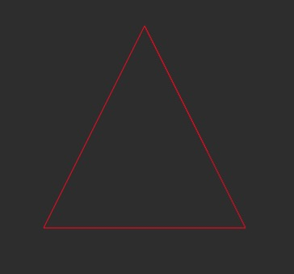
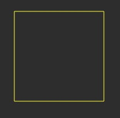
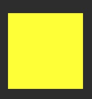

# 小试牛刀1
> WebGL 通过顶点和图元来绘制图形，我们在上面的例子中，调用 gl.TRIANGLES 绘制出了实心的三角形。如果要绘制空心三角形，我们又应该怎么做呢？有哪些图元类型可以帮助我们完成这个绘制？

webgl中有7种图元

```glsl
// gl.POINTS 孤立点 绘制一系列点
// gl.LINES 绘制一系列单独线段。每两个点作为端点，线段之间不连接
// gl.LINE_STRIP 连续线段 绘制一个线条。即，绘制一系列线段，上一点连接下一点
// gl.LINE_LOOP 连续线圈 绘制一个线圈。即，绘制一系列线段，上一点连接下一点，并且最后一点与第一个点相连
// gl.TRIANGLES 孤立三角形
// gl.TRIANGLE_STRIP 三角带
// gl.TRIANGLE_FAN 三角扇
```
以下三种可以满足要求
gl.LINES 孤立线段
gl.LINE_STRIP 连续线段
gl.LINE_LOOP 连续线圈



```js
//ex
//.....
//... 
 arr = [-0.5, -0.5, 0, 0.5, 0.5, -0.5,-0.5, -0.5]
 gl.drawArrays(gl.LINE_STRIP, 0, 4);
```

# 小试牛刀2
> 三角形是最简单的几何图形，如果我们要绘制其他的几何图形，我们可以通过用多个三角形拼接来实现。试着用 WebGL 绘制正四边形、正五边形和正六角星吧！

空心的画线段 实心的用三角形拼接



空心正四边形
```js
//...
arr = [-0.5, -0.5, -0.5, 0.5, 0.5, 0.5,0.5, -0.5]
gl.drawArrays(gl.LINE_LOOP, 0, 4);
```


实心正四边形
```js
//...
arr = [
        -0.5, -0.5, -0.5, 0.5, 0.5, 0.5,
        0.5, -0.5,-0.5, -0.5,0.5, 0.5
    ]
gl.drawArrays(gl.TRIANGLES, 0, 6);
```