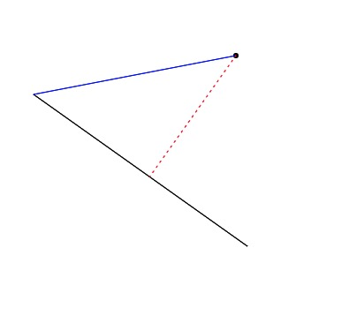

## 小试牛刀1
> 让我们延续上一节课的第 2 道思考题。已知，平面上有一点 P，它的坐标是 (x0, y0)，还有一条直线，直线上有两个点 Q(x1, y1) 和 R(x2, y2)。你能求出点 P 到直线的距离，以及点 P 到线段 QR 的距离吗？这里面，P、Q、R 这三个值可以是任意的。你可以要试着用一段 JavaScript 代码把计算的过程写出来，最好还能把直线、点和距离在 Canvas 上给直观地绘制出来。

最终效果



投影点的坐标计算是根据比例计算出来的(感觉不是最优解)

代码如下
```html
<!DOCTYPE html>
<html lang="en">

<head>
    <meta charset="UTF-8">
    <meta name="viewport" content="width=device-width, initial-scale=1.0">
    <title>Document</title>
</head>

<body>
    <canvas id="cv" width="500" height="500"></canvas>
</body>
<script>
    const canvas = document.getElementById('cv')
    const ctx = canvas.getContext('2d')

    function randomPos(size = 500) {
        return Math.ceil(Math.random() * size)
    }

    function createPoint() {
        return [randomPos(), randomPos()]
    }

    function createLine() {
        return [randomPos(), randomPos(), randomPos(), randomPos()]
    }

    //返回投影点坐标
    function caculateDistance(x0, y0, x1, y1, x2, y2) {
        let a_length = Math.sqrt(((x2 - x0) * (x2 - x0) + (y2 - y0) * (y2 - y0)))
        let b_length = Math.sqrt(((x1 - x0) * (x1 - x0) + (y1 - y0) * (y1 - y0)))
        let cosD = ((x1 - x0) * (x2 - x0) + (y1 - y0) * (y2 - y0)) / (a_length * b_length)
        let pd = cosD * a_length
        let n = pd / b_length
        let x = n * (x1 - x0) + x0
        let y = n * (y1 - y0) + y0
        return [x, y]
    }

    function draw() {
        let point = createPoint()
        let line = createLine()
        let subpoint = caculateDistance(line[0], line[1], line[2], line[3], point[0], point[1])
        ctx.arc(point[0], point[1], 3, 0, 2 * Math.PI)
        ctx.fill()
        ctx.beginPath()
        ctx.moveTo(line[0], line[1])
        ctx.lineTo(line[2], line[3])
        ctx.closePath()
        ctx.stroke()
        ctx.save()
        ctx.beginPath()
        ctx.moveTo(line[0], line[1])
        ctx.lineTo(point[0], point[1])
        ctx.closePath()
        ctx.strokeStyle = 'blue'
        ctx.stroke()
        ctx.restore()
        ctx.save()
        ctx.setLineDash([2, 5]);
        ctx.beginPath()
        ctx.moveTo(point[0], point[1])
        ctx.lineTo(subpoint[0], subpoint[1])
        ctx.closePath()
        ctx.strokeStyle = 'red'
        ctx.stroke()
    }

    draw()

</script>

</html>
```