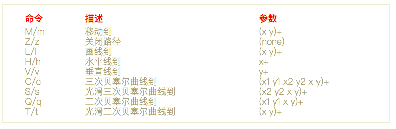

## 小试牛刀1
> Canvas2D 和 SVG 中都提供了画圆、椭圆、贝塞尔曲线的指令，你可以尝试直接使用这些指令来绘制圆、椭圆和贝塞尔曲线，然后比较一下使用这些指令和使用我们课程中讲过的方法有什么不同。
canvas

ctx.arc(x, y, radius, startAngle, endAngle, anticlockwise); <br>    
ctx.ellipse(x, y, radiusX, radiusY, rotation, startAngle, endAngle, anticlockwise);<br>  
ctx.bezierCurveTo(cp1x, cp1y, cp2x, cp2y, x, y);<br>  

svg

```html
    <svg version="1.1">
        <circle cx="50" cy="50" r="50" style="fill: red;"/> 
        <ellipse cx="50" cy="150" rx="50" ry="30" style="fill:purple"/>
        <path d='M100 300 S250 200 400 300' style="stroke:red;stroke-width:10;fill:pink;"></path>
    </svg>
```
路径指令表


不同:课程中讲过的方法更加原始，更加接近本质。 提供的指令更像是封装的语法糖。


## 小试牛刀2
> 除了圆和椭圆这些常见的参数方程，你还能自己创造出一些参数方程吗？如果可以，你可以使用 parametric.js 把它们绘制出来。

略


## 小试牛刀3
> 我在课程中，画了两个最基础的贝塞尔曲线。你能试着修改 parametric.js 的代码，调整一下贝塞尔曲线控制点参数，画出更有趣的图形吗？

略
