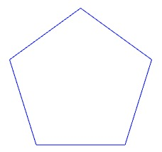
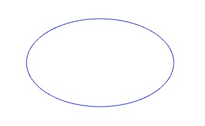

## 小试牛刀1
> 在课程中，我们使用了 Earcut 对多边形进行三角剖分。但是 tess2.js 是一个比 Earcut 更强大的三角剖分库，使用 tess2.js 可以像原生的 Canvas2D 的 fill 方法那样，实现 evenodd 的填充规则。你能试着把代码中的 earcut 换成 tess2.js，从而实现 evenodd 填充规则吗？动手之前，你可以先去读一下 tess2.js 的项目文档

[Tess2.js传送门](https://github.com/memononen/tess2.js)

代码如下
```html
<!DOCTYPE html>
<html lang="en">

<head>
    <meta charset="UTF-8">
    <meta name="viewport" content="width=device-width, initial-scale=1.0">
    <title>Document</title>
</head>

<body>
    <canvas id="cv" width="1000" height="1000"></canvas>
</body>
<script src="../libs/tess2.js"></script>
<script src="../libs/earcut.js"></script>
<script>
    
    let vertices = [[-0.7, 0.5], [-0.4, 0.3], [-0.25, 0.71], [-0.1, 0.56], [-0.1, 0.13], [0.4, 0.21], [0, -0.6], [-0.3, -0.3], [-0.6, -0.3], [-0.45, 0.0]];
    vertices = vertices.map(([x,y])=> [x*256,y*256])
    var res = Tess2.tesselate({
        contours: [vertices.flat()],
        elementType: Tess2.TRIANGLES,
        windingRule: Tess2.WINDING_NONZERO,
        polySize: 3,
        vertexSize: 2
    });
    console.log(res)
    let triangles = res.elements
    console.log(triangles)
    const cvsCtx = document.getElementById('cv').getContext('2d')
    cvsCtx.translate(200, 200)
    
    for (let i = 0; i < 8; i++) {
        cvsCtx.beginPath();
        let a = triangles[i * 3]
        let b = triangles[i * 3 + 1]
        let c = triangles[i * 3 + 2]
        cvsCtx.moveTo(res.vertices[a * 2], res.vertices[a * 2 + 1]);
        cvsCtx.lineTo(res.vertices[b * 2], res.vertices[b * 2 + 1]);
        cvsCtx.lineTo(res.vertices[c * 2], res.vertices[c * 2 + 1]);
        cvsCtx.closePath();
        cvsCtx.stroke();
    }
    // let triangles = earcut(vertices.flat()
    // for (let i = 0; i <8; i++) {
    //     cvsCtx.beginPath();
    //     cvsCtx.moveTo(vertices[triangles[i * 3]][0], vertices[triangles[i * 3]][1]);
    //     cvsCtx.lineTo(vertices[triangles[i * 3 + 1]][0], vertices[triangles[i * 3 + 1]][1]);
    //     cvsCtx.lineTo(vertices[triangles[i * 3 + 2]][0], vertices[triangles[i * 3 + 1]][1]);
    //     cvsCtx.closePath();
    //     cvsCtx.stroke();
    // }
</script>

</html>
```

## 小试牛刀2
> 今天我们用三角剖分实现了不规则多边形。那你能试着利用三角剖分的原理，通过 WebGL 画出椭圆图案、菱形的星星图案（✦），以及正五角星吗？

正五边形



```js
const points = new Float32Array([-0.65, 0.48, -0.5, 0, 0, 0, 0, 0,0.15, 0.48,-0.25, 0.77]);
gl.drawArrays(gl.LINE_LOOP, 0, points.length / 2);
```

椭圆



```js
    //生成参数方程
    function parametric(xFunc, yFunc) {
        return function (start, end, seg = 100, ...args) {
            const points = [];
            for (let i = 0; i <= seg; i++) {
                const p = i / seg;
                const t = start * (1 - p) + end * p;
                const x = xFunc(t, ...args); // 计算参数方程组的x
                const y = yFunc(t, ...args);  // 计算参数方程组的y
                points.push([x, y]);
            }
            return points
        };
    }
    //获取椭圆坐标点
    const ellipse = parametric(
        (t, a, b) => a * Math.cos(t),
        (t, a, b) => b * Math.sin(t)
    )
    ellipsePoints = ellipse(0, Math.PI * 2, 100, 0.5, 0.3)
    //....
    const points = new Float32Array(ellipsePoints.flat());
     gl.drawArrays(gl.LINE_LOOP, 0, points.length / 2);
```

其他都是类似 略